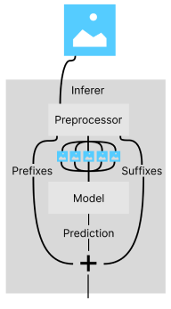

# Welcome to Handwriting Server Documentation

This section of the documentation explains our Handwriting Recognition Architecture.

## Purpose
The reason for separation of this component is to separate our application into standalone microservices. Theoretically, this server could be a standalone application for transcribing handwriting.

This modularity also makes it easier to manage deployments and updates, as each component can be updated independently without affecting the others.

## Overview of Architecture

This diagram depicts the data flow within the Handwriting Recognition Architecture. The process begins with the user uploading an image, which is then sent to the Handwriting Recognition Server. The server then utilises [preprocessors](preprocessing.md) to separate the image into lines/characters for recognition. The preprocessor also generated a suffix and prefix for each line/character. The separated images are then passed, one by one, into a [Model](models.md) for recognition. The model returns a list of characters, which are then combined into a single string. The final [Output](inference.md) is then sent back to the user.

## Contributing
The [Models](models.md) and [Preprocessors](preprocessing.md) are designed to be modular, allowing for easy addition of new models or preprocessors. If you would like to contribute a new model or preprocessor, please follow the guidelines in the [Contributing](../../docs/contributing.md) section.